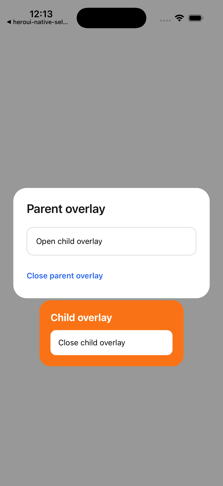
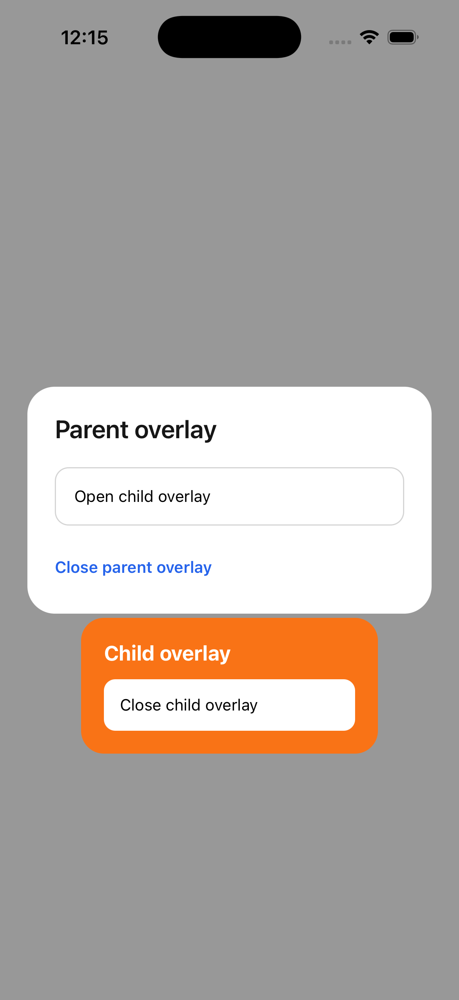

# `FullWindowOverlay` sibling order breaks after Fabric recycling

Minimal iOS reproduction for a `react-native-screens` `FullWindowOverlay` lifecycle bug. It uses two raw sibling overlays and no component library.

The project was created interactively with `bun create expo-app` using the current default Expo template, then reduced to this single screen.

## Versions

- Expo 57.0.14
- React Native 0.86.2
- React 19.2.3
- `react-native-screens` 4.27.0
- Fabric enabled by the current Expo default
- Reproduced on iPhone 17 Pro Simulator, iOS 26.5

The `overrides` entry intentionally keeps Expo Router and the app on one copy of `react-native-screens` 4.27.0.

## Run

```bash
bun install
bunx expo run:ios
```

## Deterministic steps

1. Tap **Open parent overlay**.
2. Tap **Open child overlay**. Both overlays are visible on the first cycle.
3. Tap **Close child overlay**.
4. Tap **Close parent overlay**.
5. Repeat steps 1–4.

On the fourth cycle in this clean raw reduction, the retained/recycled native overlay containers remain mounted and accessible but their visible content disappears behind the window's other subviews. The exact first failing cycle varies with component presence/animation; a HeroUI `Dialog` containing a `Select` consistently failed on cycle three in a separate clean project.

## Expected

The most recently presented child overlay stays above the parent overlay, and both stay above the app surface, on every cycle.

## Actual

The first three cycles are correct; cycle four is visually missing even though the child controls remain in the accessibility hierarchy.

| Stock cycle 3                                            | Stock cycle 4                                                     | Candidate patch, cycle 10                                                |
| -------------------------------------------------------- | ----------------------------------------------------------------- | ------------------------------------------------------------------------ |
|  |  |  |

## Reduction result

HeroUI Native and Uniwind are not involved in this reproduction. The failure is present with raw `FullWindowOverlay` siblings.

Native inspection points to the retained Fabric container lifecycle:

- `prepareForRecycle` removes `_container` but deliberately retains it.
- `maybeShow` only calls `addSubview:` when the container is absent, so it does not reassert sibling order for an attached retained container.
- A Fabric child can mount into a retained overlay without `didMoveToSuperview` or `didMoveToWindow` running again.

A local two-part experiment fixed ten raw cycles and ten HeroUI nested-overlay cycles:

1. In `maybeShow`, call `bringSubviewToFront:` when `_container.superview == window`; otherwise call `addSubview:`.
2. Call `maybeShow` after `mountChildComponentView` mounts the Fabric child.

This repository intentionally contains stock dependency code and demonstrates the bug; it does not apply that patch.
